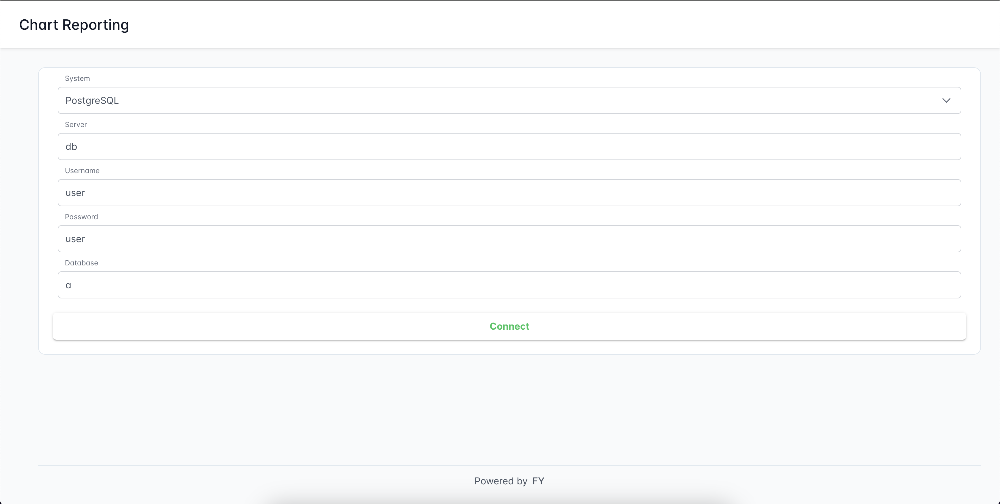

## Kullanılan Sorgular

### `departments` Tablosu Oluşturma Sorgusu

```sql
CREATE TABLE departments (
    id SERIAL PRIMARY KEY,
    name VARCHAR(100)
);

### `departments` Tablosu Oluşturma Sorgusu
CREATE TABLE employees (
    id SERIAL PRIMARY KEY,
    first_name VARCHAR(50),
    last_name VARCHAR(50),
    department_id INTEGER REFERENCES departments(id),
    hire_date DATE,
    salary NUMERIC(10,2)
);

### `employee_department_view` View Oluşturma Sorgusu
CREATE VIEW employee_department_view AS
SELECT
    e.id AS employee_id,
    e.first_name,
    e.last_name,
    d.name AS department_name,
    e.hire_date,
    e.salary
FROM
    employees e
JOIN
    departments d ON e.department_id = d.id;

### Kullanılan Örnekler

INSERT INTO employees (id, first_name, last_name, department_id, hire_date, salary)
VALUES
(1, 'John', 'Doe', 1, '2022-01-10', 55000.00),
(2, 'Jane', 'Smith', 2, '2021-06-15', 62000.00),
(3, 'Robert', 'Johnson', 3, '2020-03-22', 73000.00),
(4, 'Emily', 'Davis', 4, '2019-11-05', 58000.00),
(5, 'Michael', 'Brown', 5, '2023-02-18', 65000.00);

INSERT INTO departments (id, name)
VALUES
(1, 'Human Resources'),
(2, 'Finance'),
(3, 'Engineering'),
(4, 'Marketing'),
(5, 'Sales');

### `GetEmployeeDepartmentData` Func Oluşturma Sorgusu
CREATE OR REPLACE FUNCTION GetEmployeeDepartmentData()
RETURNS TABLE(
    emp_id integer,
    emp_first_name character varying(50),
    emp_last_name character varying(50),
    dept_name character varying(100),
    emp_hire_date date,
    emp_salary numeric(10,2)
) AS $$
BEGIN
    RETURN QUERY
    SELECT
        ev.employee_id AS emp_id,
        ev.first_name AS emp_first_name,
        ev.last_name AS emp_last_name,
        ev.department_name AS dept_name,
        ev.hire_date AS emp_hire_date,
        ev.salary AS emp_salary
    FROM
        employee_department_view ev;
END;
$$ LANGUAGE plpgsql;

```
## Çıktılar
    
    
    
    
